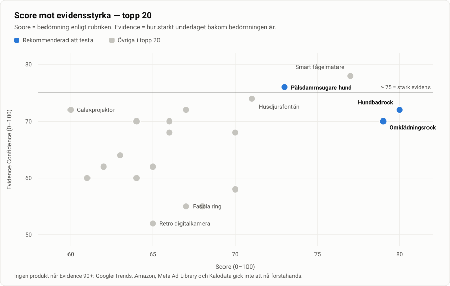
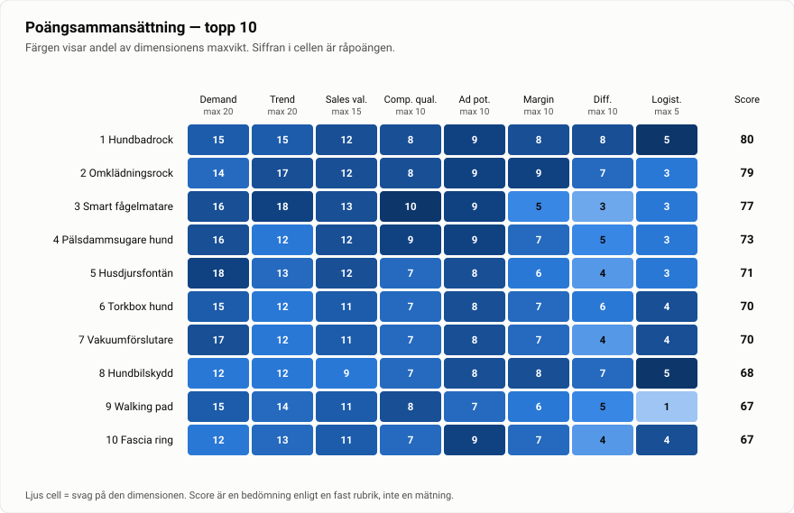

# 3. Ranking — Topp 20

> ⚠️ **Reviderad 14 sep 2026.** En djupgranskning av hundbadrocken sänkte den från **Score 80 till 69** (Evidence 72 → 84). UK:s kategoriledare omsätter under £1M, den danska premiumförebilden har tappat ~91 % i bruttovinst sedan 2023, returgraden för hundkläder är 11 %, och Amazon.de-nischen scorar 29/100. Läs [13-fordjupning-hundbadrock.md](13-fordjupning-hundbadrock.md) innan du agerar på siffrorna nedan.

**Läsanvisning.** `Score` = min bedömning enligt rubriken i [kapitel 1.4](01-metod-och-evidens.md). `Evidence` = hur starkt underlaget bakom den bedömningen är. Priser i EUR är *estimat* baserade på observerade marknadspriser; kostnader är *indikativa spann från leverantörslistningar, inte offerter*. Marginal = brutto före annonskostnad, efter produkt och frakt in.

## 3.1 Huvudtabell

| # | Produkt | Score | Evid. | Trend | Pris (retail) | Est. kostnad | Marginal | Konkurrens | Varför |
|---|---|---|---|---|---|---|---|---|---|
| 1 | **Premium hundbadrock / torkrock** | **80** | 72 | Säsongsstigande (sep–mar) | €49–69 | €9–14 | ~72–78 % | Medium | Flera lönsamma varumärken bevisar kategorin (Ruff & Tumble, Siccaro i 22+ länder, 5+ tyska märken). Ingen dominerande DTC-aktör i Sverige. Textil = lättast compliance. Perfekt säsongstajming. |
| 2 | **Omklädningsrock för vinterbad** | **79** | 70 | Stigande, brant | €109–159 | €25–40 | ~70–76 % | Medium-Hög | Starkaste trendmomentumet i hela urvalet: UK:s öppet-vatten-simmare mer än fördubblades 2016/17→2023/24; svenskars egna bastu-sökningar +141 %. Högt AOV. ⚠️ Tung IP-risk. |
| 3 | **Smart fågelmatare med kamera** | **77** | 78 | Stigande, mycket brant | €99–169 | €35–55 | ~62–68 % | Hög | Sökningar på "bird feeders" **+233 % på sex månader**. Bird Buddy: 100 000+ sålda matare. ⚠️ Men Bird Buddy äger redan svensk distribution — se varför jag ändå inte rekommenderar den. |
| 4 | **Pälsdammsugare / grooming-kit hund** | **73** | 76 | Stabil till svagt stigande | €99–149 | €30–48 | ~63–70 % | Hög | ~10 000 enheter/mån för etta på Amazon US, 123 spårade SKU:er. Fantastisk demo. Neakasa och oneisall driver riktiga EU-verksamheter. |
| 5 | **Sladdlös husdjursfontän** | **71** | 74 | Stabil, tydlig säsong | €39–59 | €12–20 | ~62–70 % | Hög | Högsta verifierade enhetsvolym i hela urvalet: **30 000/mån** för etta på Amazon US. Sökintresset toppar i september. Men kraftigt råvaruifierat. |
| 6 | **Torkbox / torkpåse för hund** | **70** | 58 | Okänd riktning | €45–75 | €12–20 | ~68–75 % | Låg-Medium | **30 000/mån** för etta på Amazon US ("pet dryer box") men mycket tunt underlag i övrigt. Intressantast som lågkonkurrens-alternativ i hundklustret. |
| 7 | **Handhållen vakuumförslutare** | **70** | 68 | Stabil | €29–49 | €7–13 | ~68–75 % | Hög | Kombinerad volym stark: 40 000/mån (kläder), 30 000/mån (generellt), 10 000+ order i april (handhållen). Suverän demo. Lågt AOV. |
| 8 | **Hundbilskydd / bagagehängmatta** | **68** | 55 | Säsongsstigande | €49–79 | €12–20 | ~70–76 % | Medium | Logisk följeslagare till #1 i samma varumärke. Icke-elektrisk, tålig, "en storlek passar de flesta". Svagast dokumenterade efterfrågan i topp 10. |
| 9 | **Walking pad / gåband under skrivbord** | **67** | 72 | Stigande | €159–299 | €90–150 | ~45–55 % | Hög | 9 000–10 000/mån, prisband $100–200 = 42 % av sortimentet. Bra AOV. ❌ 25–35 kg fraktvikt dödar ekonomin för en liten operatör. |
| 10 | **Fascia ring / EMS-återhämtning** | **67** | 55 | Viral, troligen nära topp | €39–69 | €10–18 | ~68–75 % | Hög | ADDWIN Fascia Ring omsatte **~$1,78 M i juli 2026**. Snabb kurva. ⚠️ EMS kan klassas som medicinteknik i EU beroende på påstående. |
| 11 | **Automatisk kattlåda** | **66** | 70 | Stigande | €249–449 | €120–200 | ~48–58 % | Hög | 74 000 sökningar; marknaden ~$1,99 mdr 2026. Litter-Robot $599–799 lämnar utrymme under. ❌ Skrymmande, hög returrisk, hög kapitalbindning. |
| 12 | **Handhållen bildammsugare** | **66** | 68 | Stabil | €35–59 | €11–18 | ~65–70 % | Hög | **40 000/mån** för etta på Amazon US. Enorm efterfrågan men extremt råvaruifierat och svårt att differentiera. |
| 13 | **Värmesulor / värmestrumpor** | **65** | 62 | Skarp säsong (okt–feb) | €59–99 | €18–30 | ~62–70 % | Medium | 8 000+ order i april på "electric socks" på Amazon US — mot bara ~400 för "womens heated vest". Fötterna, inte bålen, är efterfrågan. |
| 14 | **Retro digitalkamera (CCD)** | **65** | 52 | Stigande, kulturdriven | €69–129 | €22–40 | ~62–70 % | Medium | Gen Z-driven estetikvåg; retro *digital* har högre sökvolym än retro film. ⚠️ Kvalitets- och sourcingrisk är den största i hela listan. |
| 15 | **Elektrisk spinnskrubb** | **64** | 70 | **Fallande** | €29–45 | €9–14 | ~62–70 % | Mycket hög | 33 M+ TikTok-visningar, tre ASIN:er kring 10 000/mån — men ledarna faller **−20 % respektive −40 % MoM**. Klassiskt sencykel-läge. |
| 16 | **Digital fotoram** | **64** | 60 | Stigande mot Q4 | €99–179 | €35–60 | ~58–66 % | Hög | Starkt presentköp med högt AOV. Aura växte $1,4 M→$3,7 M ARR. Men kräver app/moln = supportbörda. |
| 17 | **Gryningslampa / wake-up light** | **63** | 64 | Skarp nordisk säsong | €49–89 | €15–26 | ~62–70 % | Hög | 1 000–8 000/mån på Amazon US; perfekt nordisk logik. ⚠️ Philips äger kategorin i svenskt medvetande, och MDR-gränsen kring SAD-påståenden är knivskarp. |
| 18 | **Avfuktarpåsar / fuktabsorbent** | **62** | 62 | Stabil, säsong | €19–35 (bundle) | €4–8 | ~70–78 % | Hög | 30 000/mån på Amazon US. Förbrukningsvara = repeat purchase. ❌ För lågt AOV för att bära betald trafik ensamt. |
| 19 | **Designad växtbelysning** | **61** | 60 | Stabil | €39–79 | €12–22 | ~65–72 % | Medium | 1 000–4 000/mån; $20–50 = 46 % av sortimentet. Nordisk vinterlogik är stark, men efterfrågan är mindre än den känns. |
| 20 | **Sunset- / galaxprojektor** | **60** | 72 | **Mättad** | €29–49 | €9–15 | ~62–68 % | Mycket hög | 89 M TikTok-visningar och 8 000–10 000/mån — men *samma ASIN* dominerar tolv olika sökord. Ren råvara. Med här som varning, inte rekommendation. |

## 3.2 Fullständigt scoreblad

Delpoäng, maxvikt inom parentes.

| # | Produkt | Demand (20) | Trend (20) | Sales val. (15) | Comp. qual. (10) | Ad pot. (10) | Margin (10) | Diff. (10) | Logist. (5) | **Total** |
|---|---|---|---|---|---|---|---|---|---|---|
| 1 | Hundbadrock | 15 | 15 | 12 | 8 | 9 | 8 | 8 | 5 | **80** |
| 2 | Omklädningsrock | 14 | 17 | 12 | 8 | 9 | 9 | 7 | 3 | **79** |
| 3 | Smart fågelmatare | 16 | 18 | 13 | 10 | 9 | 5 | 3 | 3 | **77** |
| 4 | Pälsdammsugare hund | 16 | 12 | 12 | 9 | 9 | 7 | 5 | 3 | **73** |
| 5 | Husdjursfontän | 18 | 13 | 12 | 7 | 8 | 6 | 4 | 3 | **71** |
| 6 | Torkbox hund | 15 | 12 | 11 | 7 | 8 | 7 | 6 | 4 | **70** |
| 7 | Vakuumförslutare | 17 | 12 | 11 | 7 | 8 | 7 | 4 | 4 | **70** |
| 8 | Hundbilskydd | 12 | 12 | 9 | 7 | 8 | 8 | 7 | 5 | **68** |
| 9 | Walking pad | 15 | 14 | 11 | 8 | 7 | 6 | 5 | 1 | **67** |
| 10 | Fascia ring | 12 | 13 | 11 | 7 | 9 | 7 | 4 | 4 | **67** |
| 11 | Automatisk kattlåda | 15 | 14 | 11 | 9 | 7 | 5 | 4 | 1 | **66** |
| 12 | Bildammsugare | 17 | 11 | 11 | 7 | 8 | 6 | 3 | 3 | **66** |
| 13 | Värmesulor | 14 | 13 | 10 | 6 | 7 | 7 | 5 | 3 | **65** |
| 14 | Retro digitalkamera | 12 | 16 | 9 | 6 | 8 | 6 | 5 | 3 | **65** |
| 15 | Spinnskrubb | 16 | 9 | 11 | 7 | 9 | 5 | 3 | 4 | **64** |
| 16 | Digital fotoram | 13 | 12 | 10 | 8 | 7 | 6 | 5 | 3 | **64** |
| 17 | Gryningslampa | 13 | 11 | 10 | 8 | 7 | 6 | 5 | 3 | **63** |
| 18 | Avfuktarpåsar | 16 | 10 | 11 | 7 | 6 | 5 | 3 | 4 | **62** |
| 19 | Växtbelysning | 11 | 12 | 9 | 6 | 7 | 6 | 6 | 4 | **61** |
| 20 | Sunset-/galaxprojektor | 15 | 8 | 11 | 7 | 9 | 4 | 2 | 4 | **60** |

## 3.3 Trendklassificering

| Klass | Produkter |
|---|---|
| **Evergreen** (stabil långsiktig efterfrågan) | Husdjursfontän, vakuumförslutare, bildammsugare, hundbilskydd |
| **Rising trend** (växande, bevisad) | Omklädningsrock, smart fågelmatare, walking pad, automatisk kattlåda, retro digitalkamera |
| **Seasonal** (skarp periodicitet) | **Hundbadrock**, värmesulor, gryningslampa, växtbelysning, avfuktarpåsar, torkbox hund |
| **Viral fad** (kort livslängd trolig) | Fascia ring |
| **Saturated** (stor efterfrågan, för många säljare) | Elektrisk spinnskrubb, sunset-/galaxprojektor, pälsdammsugare (gränsfall) |

**Notera vad prioriteringen blev.** Du bad mig prioritera *rising trend + proven demand + utrymme för differentiering* framför rena viralprodukter. Det enda rena fadet i listan (fascia ring) hamnade på plats 10 trots hårda försäljningssiffror — just för att kurvan sannolikt redan toppat och för att EMS-påståenden riskerar MDR-klassning. Omvänt: hundbadrocken är "bara" säsongsbetonad, inte exploderande — men den kombinerar bevisad efterfrågan, flera lönsamma referensbolag, låg regulatorisk tyngd och ett verkligt utrymme att bygga varumärke. Det är den kombinationen som vinner på riskjusterad basis, inte den brantaste kurvan.

## 3.4 Produkter jag medvetet uteslöt — och varför

| Produkt / kategori | Varför den föll bort |
|---|---|
| **Skincare, PDRN-krämer, kollagenbalm** | Kategorins faktiska toppsäljare globalt (£2,49 M för en enda produkt i UK). Kräver CPNP-notifiering + EU Responsible Person. Inte genomförbart som snabbtest. |
| **Kosttillskott (magnesium, ashwagandha)** | Nationella anmälningsregimer, hälsopåståenderegler. Samma slutsats. |
| **Tandblekningsremsor (t.ex. lila remsor)** | £2,37 M på TikTok Shop UK — men väteperoxidhalt över 0,1 % får bara tillhandahållas via tandläkare i EU. Regulatorisk fälla. |
| **Smart ring** | Marknaden växer snabbt, men Oura har **76–85 % andel** och två av konkurrenterna (Ultrahuman, RingConn) drabbades av **importförbud i USA i en patenttvist**. Patentminfält. |
| **Barfotaskor** | Hike Footwear omsätter uppskattningsvis $7,5–13,7 M/mån — men storlekar + 14–30 dagars leverans + "F-rating" hos recensionsaggregatorer. Visar exakt hur skulden hinner ikapp. |
| **Padel-utrustning** | Global Padel Report 2026: Sverige är i **"forced consolidation"** efter överexpansion. Inte en stigande svensk marknad. |
| **Generiska mobilskal, t-shirts, smycken** | Din egen uteslutningslista, och jag håller med. BURGA är undantaget som bekräftar regeln — och de byggde 20 000+ SKU:er och egen produktion för att komma dit. |
| **Kallbadstunna / isbad** | Bra nordisk logik och högt AOV, men skrymmande, hög kapitalbindning och redan bearbetad av svenska specialister (Bastuexperten, Nordiska Bryggor, isbad.se). |
| **Bastufilt (infraröd)** | Stigande sökintresse sedan sent 2024, men terapeutiska påståenden → MDR-risk, plus elektrisk säkerhet och skrymmande frakt. |
| **LED-hundhalsband** | Nordisk logik perfekt — men redan väl bearbetat i Sverige (Biltema, Granngården, SmartaSaker, Orbiloc från 119–149 SEK). Lågt AOV, ingen lucka. |
