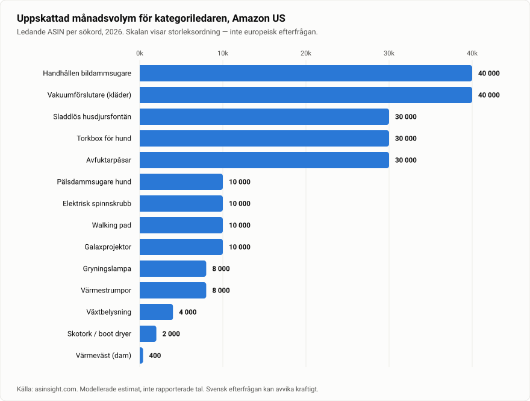

# 4. Djupanalys — Topp 20, en i taget

> Notation: **fet siffra** = rapporterad av källa · *kursiv* = mitt estimat/min beräkning · `UNKNOWN` = ej verifierbart · ⚠️ = risk eller motstridiga källor

*Kalibreringsbild för hela kapitlet. Lägg märke till skalan längst ned: **värmeväst 400 enheter mot värmestrumpor 8 000** — kategorierna har ungefär lika många spårade produkter. Det är fötterna som säljer, inte bålen.*

---

## #1 — Premium hundbadrock / torkrock
**Score 80 · Evidence 72 · Seasonal (sep–mar) · Saturation: Medium**
> ⚠️ **Överspelad.** Bedömningen nedan är den ursprungliga. [Kapitel 13](13-fordjupning-hundbadrock.md) sänker den till **Score 69 / Evidence 84** på hårdare bolags- och returdata. Där de två går isär gäller kapitel 13.

### Varför den är intressant
Det här är en kategori där flera oberoende bolag redan tjänar pengar på premiumpositionering, men där ingen bygger ett modernt DTC-varumärke mot den svenska marknaden. Problemet den löser är konkret, återkommande och uppstår varje gång det regnar: en blöt, lerig hund i en hall eller en bil. Produkten är textil, vilket betyder att den slipper hela WEEE- och batteriregelverket, tål att postas i ett mjukt paket och aldrig går sönder i transport. Och den demonstrerar sig själv på åtta sekunder.

### Demand evidence
- **1 079 000 registrerade hundar och 778 000 registrerade hundägare i Sverige** (Jordbruksverkets hundregister, januari 2026); **782 724 registrerade hundägare per 1 september 2026**
- **90 miljoner hundhushåll i Europa**, 306 miljoner husdjur totalt i 140 miljoner hushåll (49 % av alla EU-hushåll) — FEDIAF Facts & Figures
- Tillbehör och veterinärtjänster utgör **€24,6 mdr** utöver fodermarknaden, och växer **9 %** — FEDIAF
- Tyska marknaden har minst sex konkurrerande märken i prisspannet **€12,49–54,99** (TrendPet Dampfhund €45,99–54,99, Rudelkönig €36,95, UOSIA €25,19, HOMELEVEL €18,49, Bestlivings €12,49) — vergleich.org, countrydog.de. Ett så tätt besatt prisband betyder att kategorin *säljer*.
- Svenska återförsäljare som redan för kategorin: VetZoo (Siccaro-sortiment), Zoo.se, Djurslottet, Hund.se, Amazon.se

### Trend evidence
- Säsongsmönstret är produktens själva logik: efterfrågan följer regn, lera och snö, alltså **september–mars i Norden**. Du startar 14 september.
- UK:s hundpopulation har ökat **~8–10 % sedan 2020** till uppskattningsvis 13–14 miljoner; **72 %** av hundägarna har ökat sina utgifter på grooming-produkter
- Global grooming-marknad **$19,5 mdr 2026** → prognos $46,7 mdr 2036 (9,1 % CAGR)
- ⚠️ **Motbevis jag hittade mot min egen tes:** nyregistreringarna av hundar i Sverige under 2025 var **56 801 — lägst på åtta år**, ned från toppen på ~78 000 under 2021. Den svenska hundpopulationen växer alltså inte längre. Efterfrågan bärs av den *installerade basen* på en dryg miljon hundar, inte av tillväxt. Det är en reell försvagning av casen och jag har viktat ner Demand till 15/20 på grund av den.
- `UNKNOWN`: specifik Google Trends-kurva för "hundbadrock"/"dog drying coat" i SE/DE. Kunde inte hämtas.

### Winning companies
| Bolag | Land | Vad de bevisar |
|---|---|---|
| **Ruff & Tumble** | UK (Norfolk, bolag reg. 2017) | Startade "på ett köksbord i Dorset", kallar sig marknadsledare i UK på just dog drying coats. Prisband **£43,95–54,95**. Signatur: dubbellager naturlig bomullsfrotté. Omsättning `UNKNOWN` (Companies House-siffror gick ej att hämta). |
| **Siccaro** | Danmark (grundat 2013) | Egen patenterbar textilteknologi ("Wet2Dry"), återförsäljare i **22+ länder**, premiumpositionering. Exklusiv svensk distribution via VetZoo. Bevisar att ett *nordiskt* varumärke kan gå internationellt på den här produkten. |
| **TrendPet (Dampfhund)** | Tyskland | Håller **€45,99–54,99** i en marknad där €12 finns tillgängligt. Bevisar att premiumprissättning fungerar. |
| **Pawdaw of London, DryPaws, CozyPaws, RainyPaws** | UK | En hel underkategori av "muddy dog"-varumärken. Pawdaw blev finalist för Product Innovation Award hos Pet Industry Federation. |

### Pris / kostnad / marginal
- **Retail:** €49–69 (motsvarar *549–749 SEK*). Referenspunkter: Ruff & Tumble £43,95–54,95; TrendPet €45,99–54,99; Siccaro högre.
- **Kostnad:** *€9–14* landat vid MOQ 100–200. En Alibaba-listning anger "nära $9 styck" för djurbadrock; typisk konstruktion 80 % polyester / 20 % polyamid; MOQ-spann på plattformen 3–3 200 st, vanligen 100–200; provledtid 5–7 arbetsdagar. **Detta är listningsuppgifter, inte offerter.**
- **Marginal:** *~72–78 % brutto* vid €59 retail och €13 landat.
- **Bidrag per order efter frakt ut (~55 SEK / €5):** *~€41 vid €59 pris* → **break-even ROAS ~1,44×**. Det är ovanligt gynnsamt.

### Target customer
Hundägare 30–60 år, övervägande kvinnor i inköpsbeslutet, bor i villa eller radhus, kör bil till promenaden, äger en medelstor till stor hund med päls som håller vatten (labrador, golden, sprinter spaniel, vorsteh, blandras). Sekundär: hundägare med ljus inredning eller ny bil. Tertiär: presentköpare till hundägare i Q4.

### Main problem / desire
**Problem:** blöt hund → blöt hall, blöt bil, blöt soffa, lukt, och 20 minuters handdukskamp varje regnig dag.
**Desire:** att promenaden är slut när du kommer hem. Sekundärt: att hunden inte fryser, vilket ger köpet en omsorgsdimension utöver bekvämlighet.

### Best marketing angle
Sälj **tiden och hallen**, inte handduken. Den emotionella kroken i Norden är mörker + regn + lera från september: "Hösten börjar. Din hall vet det redan." Positionera premium mot bomullshandduken (inte mot billiga konkurrenter) — jämförelsen ska vara "handduk vs. rock", inte "vår rock vs. deras rock".

### Creative concept (5 st)
1. **Split-screen, 8 sekunder.** Vänster: blöt hund + handduk + kaos + blöt golv. Höger: rock på, hund lägger sig, klart. Ingen voiceover, bara text: "Samma hund. Samma promenad."
2. **Hallgolvet.** Kamera fast på hallgolvet. Dag 1 utan rock: pölar. Dag 2 med rock: torrt. Textoverlay med datum.
3. **Bilbagaget.** Hund hoppar in blöt → klipp → ren bilklädsel. Riktar in sig på bilägare, som är den mest betalningsvilliga undergruppen.
4. **Ägarens ansikte först** (+20–30 % CTR enligt kreativdata): "Jag köpte den här för hunden. Jag behöll den för hallen."
5. **15-sekunders passformsguide** där en verklig hund mäts. Löser det största konverteringshindret (storlek) *i annonsen* istället för på produktsidan.

### Best platform
**Meta (Facebook + Instagram) som primär kanal.** Hundägare 30–60 finns där, svenska CPM:er ligger **$9,10–13,5** mot globalt **~$20,9**, och Facebook-hundgrupper är en organisk multiplikator som inte finns på samma sätt på TikTok. **TikTok organiskt som sekundär** (TikTok Shop finns inte i Sverige). Pinterest som billig tredje kanal för höst-/hem-innehåll.

### Saturation
**Medium.** Många säljare finns, men de är antingen breda zoo-återförsäljare (VetZoo, Zoo.se, Arken Zoo) eller utländska premiummärken som säljer *genom* dem. Ingen driver ett svenskt DTC-varumärke med UGC och paid social mot kategorin. Det är luckan.

### Trend classification
**Seasonal** med evergreen-underlag. Kurvan upprepas varje år; den exploderar inte.

### Risks
1. **Storlekar → returer.** Svensk e-handel har 5,9 % returgrad totalt men **22,8 % för mode** (Kustom, 78,6 M köp). Rocken har storlekar och sitter därför närmare modeprofilen. **Detta är den enskilt största risken.** Mitigering: bröstomfångsguide, rasspecifik tabell, video som visar mätning, och hellre en generös men tydligt kommunicerad passform än fem storlekar.
2. **Prispress underifrån.** Tyskland har fungerande alternativ vid €12–25. Om du inte kan motivera €59 med material, passform och varumärke förlorar du på pris.
3. **Textil-EPR kommer.** Reviderat avfallsdirektiv (EU) 2025/1892; nationella system i drift ~2027–2028. Svenskt startdatum `UNKNOWN`. Bygg in en framtida avgift i kalkylen.
4. **Säsongsberoende.** Mars–augusti är svag. Antingen accepterar du det, eller så bygger du ut sortimentet (bilskydd, tassrengöring, sommartorkning efter bad).
5. **Låg teknisk innovationshöjd.** Din vallgrav är varumärke, passform och innehåll — inte produkten. Om du inte kan bygga varumärke ska du inte välja den här.

### Evidence sources
| Källa | Vad den visar | Nivå |
|---|---|---|
| Jordbruksverkets hundregister | 1 079 000 hundar, 782 724 ägare (sep 2026), 56 801 nyreg. 2025 = lägst på 8 år | A |
| FEDIAF Facts & Figures | 306 M husdjur i EU, 90 M hundhushåll, €24,6 mdr tillbehör/vård, +9 % | A |
| Kustom "Behind the Returns 2026" | 5,9 % vs 22,8 % returgrad, 78,6 M köp | B |
| vergleich.org / countrydog.de | Tyska prisspannet €12,49–54,99 med namngivna märken | C |
| ruffandtumbledogcoats.com, siccaro.com | Positionering, prissättning, 22+ länder | C |
| Alibaba-listningar | MOQ-spann, materialspec, indikativt ~$9 | D |

---

## #2 — Omklädningsrock för vinterbad
**Score 79 · Evidence 70 · Rising trend · Saturation: Medium-Hög**

> ⚠️ **Överspelad — uppåt.** [Kapitel 14](14-fordjupning-omkladningsrock.md) höjer den till **Score 80 / Evidence 85** och gör den till rapportens etta. Där de två går isär gäller kapitel 14.

### Varför den är intressant
Det starkaste trendmomentumet jag hittade i hela urvalet, kombinerat med det högsta realistiska AOV:t bland de icke-elektriska produkterna. Kallbad har gått från särintresse till folkrörelse i Norden, och produkten är själva uniformen för den rörelsen. Marginalen är utmärkt och innehållet skriver sig självt — men kategorin har en dokumenterad, aggressivt försvarad varumärkesrätt som du måste navigera exakt rätt kring.

### Demand evidence
- UK: regelbundna öppet-vatten-simmare **~266 000 (2016/17) → 543 000 (2023/24)** — mer än en fördubbling. **7,5+ miljoner** människor doppar sig minst någon gång. Utomhussim-grupper **+340 % mellan 2019 och 2024** (Outdoor Swimmer Magazine m.fl.)
- Visit Sweden: internationellt sökintresse för bastu i Sverige **+47 % under 2024**; **svenskarnas eget sökintresse +141 %**
- Umeå kallbad samlar **upp till 150 personer** vid enskilda tillfällen
- Marknaden är prisbevisad i toppen: **Dryrobe Advance £170–185**, och kategorin har enligt domstolsunderlaget **cirka 200 konkurrerande varumärken**
- Svensk återförsäljarnärvaro finns redan: Watery.se (**45+ modeller** badponcho), SURFMORE.se, EuroSkateShop, NORDBAEK (DK)

### Trend evidence
- Deltagandekurvan ovan är den hårdaste trendevidensen i rapporten: den är en *beteendeförändring över sju år*, inte en sökspik
- Svenska medier och aktörer beskriver 2026 som året då **åretrunt-bad blev standard** snarare än vintersport
- Q4 är kategorins naturliga topp i Norden — säsongen börjar nu
- `UNKNOWN`: svensk sökvolym specifikt för "omklädningsrock" / "badponcho vuxen". Kunde inte hämtas.

### Winning companies
| Bolag | Land | Vad de bevisar |
|---|---|---|
| **Dryrobe** | UK, grundat 2010 av surfaren Gideon Bright | Skapade kategorin (första brittiska changing robe 2011, första varumärkesregistrering 2013). Höll ensamrätt till ~2018. Prisar **£170–185**. Bevisar att €200-prispunkten håller. |
| **Red Original, Northcore, Voited, Passenger, Alpkit, Fourth Element, Cosimac, Sundried** | UK/EU | Att ~200 varumärken kan samexistera betyder att marknaden är djup, inte att den är stängd |
| **NORDBAEK** | Danmark | Nordisk designpositionering med fleece- eller frottéfoder, riktad mot åretruntbadare — närmaste analogin till det du skulle bygga |
| **Watery.se** | Sverige | 45+ modeller hos en enda svensk återförsäljare = kategorin är efterfrågad i Sverige, men säljs som *sortiment*, inte som varumärke |

### Pris / kostnad / marginal
- **Retail:** €109–159 (*1 199–1 749 SEK*). Under Dryrobe men klart över badponcho-nivån.
- **Kostnad:** *€25–40* landat. Mikrofiber-ponchohandduk börjar runt **$5,38**; en riktig vattentät, sherpafodrad rock ligger betydligt högre. MOQ på plattformen 1–100 st. **Priset för en korrekt specad rock är `UNKNOWN` utan offert — detta är det viktigaste att verifiera innan köp.**
- **Marginal:** *~70–76 %* vid €129 retail och €33 landat.
- **Bidrag per order efter frakt ut (~€7, tyngre paket):** *~€89* → **break-even ROAS ~1,45×**

### Target customer
Primär: kallbadare och vinterbadare 28–55, jämn könsfördelning, urbana och kustnära, hög disponibel inkomst, delar aktiviteten på sociala medier. Sekundär: surfare, öppet-vatten-simmare, triathleter, föräldrar vid simhall/strand. Tertiär: presentköpare i Q4 — det här är en **utmärkt julklapp** i prisklassen 1 000–1 500 SEK.

### Main problem / desire
**Problem:** att byta om utomhus i 4 grader, i blåst, på en parkeringsplats, utan att tappa värdigheten eller kroppsvärmen.
**Desire:** tillhörighet. Rocken är ett medlemskort i en identitet som är socialt högt värderad just nu. Det är därför prispunkten håller — du säljer inte textil, du säljer att se ut som någon som badar året runt.

### Best marketing angle
Sälj **de fem minuterna efter doppet**, inte doppet. Alla filmar isvaken; ingen filmar skakningarna efteråt. Nordisk vinkel: "Vi uppfann inte kallbad. Vi fixade bara det jobbigaste med det."

### Creative concept (4 st)
1. **Efteråt-klippet.** Filma aldrig vattnet. Börja när personen kommer upp — huttrande, blåfryst — och håll kameran tills rocken är på och ansiktet slappnar av. Hela annonsen är den övergången.
2. **Omklädning på parkeringen.** POV: byta om bakom en bildörr i blåst med handduk vs. göra det stående i rocken. Rent funktionell jämförelse.
3. **Bryggan klockan sju.** Gruppfilm av en riktig kallbadsgrupp. Samma rock på fem personer. Säljer tillhörighet, inte funktion.
4. **Materialbeviset.** Häll en kanna vatten på utsidan, vänd insidan ut, visa att den är torr. Rakt, bevisdrivet, fungerar utmärkt som andra annons i sekvensen.

### Best platform
**Meta primärt** (åldersgruppen, Facebook-grupperna för vinterbad i Sverige är stora och aktiva). **Instagram Reels** för estetiken. **TikTok organiskt** för räckvidd — kallbadsinnehåll presterar naturligt högt. Pinterest fungerar för Q4-presentsökningar.

### Saturation
**Medium-Hög globalt, Medium i Sverige.** ~200 varumärken i UK, men den svenska marknaden köper fortfarande via multi-brand-återförsäljare. Ett nordiskt varumärke med egen passform och egen berättelse har utrymme.

### Trend classification
**Rising trend** — den tydligaste i listan.

### Risks
1. ⚠️ **IP-risk, och den är konkret.** Den **4 december 2025** vann Dryrobe Limited i brittiska IPEC (domare Melissa Clarke) mot Caesr Group Ltd ("D-Robe Outdoors") för **varumärkesintrång och passing off**. Motpartens invändning om att "dryrobe" blivit generiskt **avslogs**. Domstolen fann medel till hög likhet mellan DRYROBE och D-ROBE, och **över 30 kunder hade kontaktat Dryrobe för att returnera D-Robe-produkter**. Dryrobe driver aktiv bevakning med crawler-teknik och ett externt enforcement-bolag, och kontaktar rutinmässigt företag som använder "dryrobe" eller "dry robe".
   → **Praktisk regel:** använd aldrig orden *dryrobe*, *dry robe* eller något som liknar *D-robe* i varumärke, domän, produktnamn, annonstext, alt-text eller metadata. Använd **"omklädningsrock"** på svenska och **"changing robe"** på engelska — den generiska termen som Dryrobe själva förespråkar. Gör en varumärkessökning i EUIPO och PRV innan du registrerar något namn.
2. **Fraktvikt.** 1,5–2,5 kg och skrymmande. Räkna med €6–9 i fraktkostnad, inte €5.
3. **Högre kapitalbindning.** €33 × 50 enheter = ~€1 650 (*ca 18 000 SEK*) bara i första ordern. Det äter en stor del av en 10–50 000-budget.
4. **Kvalitetskänslig kategori.** Vid €129 förväntar sig kunden riktig vattentäthet och riktigt foder. En dålig första batch dödar varumärket. **Beställ prover och testa i verkligt väder innan du lägger order.**
5. **Säsong.** Nordisk topp okt–feb; svag maj–augusti.

### Evidence sources
| Källa | Vad den visar | Nivå |
|---|---|---|
| IPEC-domen 4 dec 2025 (refererad av DWF, Lexology, Marks & Clerk, Hamlins, 4 New Square) | Dryrobe vann mot D-Robe; genericide-invändning avslogs; enforcement-metodik beskriven | A |
| Outdoor Swimmer Magazine m.fl. | 266 000 → 543 000 regelbundna simmare i UK; grupper +340 % | B |
| Visit Sweden / Turismnytt | Bastu-sökintresse +47 % internationellt, **+141 % bland svenskar** (2024) | B |
| Wikipedia / Board-worx / heatedgear360 | Dryrobe grundat 2010, pris £170–185, konkurrentlista | C |
| Watery.se, SURFMORE.se, NORDBAEK | Svensk/nordisk återförsäljarstruktur och sortimentsdjup | C |
| Alibaba-listningar | Mikrofiberponcho från $5,38, MOQ 1–100 | D |

---

## #3 — Smart fågelmatare med kamera
**Score 77 · Evidence 78 · Rising trend (brant) · Saturation: Hög**

### Varför den är intressant
Det här är den brantaste efterfrågekurvan i hela researchen och samtidigt det tydligaste exemplet på varför hög score inte är samma sak som bra val. Sökningar på fågelmatare är upp **233 % på sex månader**, fågelskådning har vuxit **47 % sedan 2018** med **+1 088 % bland Gen Z**, och i Sverige är fågelmatning redan en folkrörelse med flera hundratusen utövare som startar sin säsong i oktober. Innehållet är oemotståndligt — närbilder på fåglar är bland det mest delningsbara som finns. Problemet är att kategorin redan har en vinnare, och att den vinnaren redan äger svensk hyllplats.

### Demand evidence
- **"Bird feeders": 135 000 sökningar, +233 % på sex månader** (Glimpse/risingtrends-data)
- UK: RSPB uppskattar **över 4 miljoner fågelskådare**, upp från **2,7 miljoner för åtta år sedan**. Regelbunden fågelskådning **+47 % sedan 2018**, **Gen Z +1 088 %**
- Big Garden Birdwatch 2026: **650 279 deltagare**, **9+ miljoner fåglar** räknade, 80+ arter. Big Schools' Birdwatch: rekord **143 000 deltagare**
- UK:s fågelmatarmarknad prognostiseras till **~£172 M till 2035** (~5 %/år)
- Sverige: fågelmatning beskrivs som en folkrörelse med **flera hundratusen utövare**; BirdLife Sveriges "Vinterfåglar inpå knuten" samlar **15 000–20 000 hushåll**; fågelfoderförsäljningen "exploderar" när vintern kommer
- Smart bird-feeder-camera-marknaden växer **11–12 % CAGR**; solcellsdrivna varianter **14,8 % CAGR 2026–2034**

### Trend evidence
- +233 % på sex månader är den högsta verifierade tillväxtsiffran i rapporten
- Produktcykeln är aktiv: **Bird Buddy 2 + Bird Buddy 2 Mini lanserades januari 2026** (2K HDR); **Birdfy Metal 2 4K lanserades april 2026 uttryckligen mot Europa och Asien-Stillahavsområdet**
- ⚠️ **Motbevis:** samma datakälla som visar +233 % för fågelmatare konstaterar att **"smart-gadget-hypen har svalnat"** inom husdjur och att momentum flyttat till mat, berikning och tillskott. Kurvan kan alltså gälla *fågelmatning* snarare än *smarta* fågelmatare.

### Winning companies
| Bolag | Land | Vad de bevisar |
|---|---|---|
| **Bird Buddy** | Slovenien | Kickstarter nov 2020: **~€4,2 M från ~23 000 backare**. Andra kampanjen (juni 2023): **$3 139 884 från 10 134 backare**. **$8,5 M** VC från Backed och General Catalyst. **100 000+** sålda originalmatare. Rapporterat "från Kickstarter till **$100 miljoner** i intäkt". CES Innovation Award 2022–2024. |
| **Netvue / Birdfy** | Kina/USA | Realtidsartigenkänning, nivåindelad molnlagring. Lanserade premiummodell mot EU april 2026. |
| **Reolink, Arlo, Eufy (Anker), Wasserstein** | — | Etablerade kameratillverkare har gått in i kategorin = marknaden är stor nog att locka dem |

### ⚠️ Varför jag ändå inte rekommenderar den
**Bird Buddy äger redan svensk distribution.** Produkten säljs hos **Arken Zoo, VetZoo (uppges ha exklusivitet), Elgiganten, SmartaSaker och Pippifoder**. Birdfy finns hos Pippifoder m.fl.

Det betyder att du som ny aktör skulle:
- konkurrera mot ett varumärke med **$100 M i intäkt**, CES-priser och en AI-app med artdatabas
- mot en produkt som redan står på **Elgigantens** hylla — alltså med svensk garanti, support och retur
- med en hårdvaruklon som kräver **app, molntjänst, artigenkänning, firmware-uppdateringar och kundsupport på svenska**

Det är inte ett dropshipping-test. Det är en produktutvecklingssatsning. Hårdvara med mjukvaruberoende är den sämsta möjliga första produkten med 10–50 000 kr.

### Pris / kostnad / marginal
- **Retail:** €99–169 · **Kostnad:** *€35–55* · **Marginal:** *~62–68 %*
- Marginalen är lägre än topp-2 *och* bär supportkostnad, garantiärenden och WEEE/batteriregistrering.

### Target customer
45–75 år, villaägare eller radhus med trädgård eller balkong, ofta pensionär eller nära pension, hög betalningsvilja för trädgård. Sekundär och snabbast växande: **Gen Z** (+1 088 % fågelskådning), som dock köper billigare. Tertiär: presentköpare — det här är en klassisk julklapp till föräldrar.

### Main problem / desire
Inte ett problem — en **desire**: kontakt med naturen utan ansträngning, och den lilla dagliga glädjen i en notis som säjer att en talgoxe just kom. Sekundärt: identifiering ("vilken fågel var det?").

### Best marketing angle
Den fungerande vinkeln är **notisen**, inte mataren: "Din telefon vibrerar. Det är en blåmes." Nordisk variant: "Mörkret kommer. Ge dem något att komma till."

### Creative concept (3 st)
1. **Telefonskärmen.** Enbart notisen + den öppnade appen med fågelbilden. Produkten syns knappt. Säljer upplevelsen.
2. **Fönsterperspektivet.** Farfar/mormor vid köksbordet, telefonen bredvid kaffet, fågel landar, ansiktet lyser upp. Presentvinkel för Q4.
3. **Artsamlingen.** Snabbmontage av 20 arter över en säsong, med namn. Spelar på samlarinstinkt.

### Best platform
Meta (åldersgruppen), och **Facebook-grupper för trädgård och fågelskådning** är en enorm organisk kanal. YouTube fungerar ovanligt bra för långt fågelinnehåll.

### Saturation
**Hög i det smarta segmentet.** Låg-medium i *designade, icke-elektroniska* matare — det är där en eventuell öppning finns.

### Trend classification
**Rising trend**, men incumbent-låst.

### Risks
1. Etablerad marknadsledare med app-ekosystem, retailhyllor i Sverige och $100 M i intäkt
2. Hårdvara + mjukvara + moln = supportbörda långt bortom dropshipping
3. WEEE + batteriregistrering + kamera (integritetsfrågor gentemot grannar)
4. Klonprodukter från Kina konkurrerar nedåt i pris utan att kunna matcha appen
5. ⚠️ Trenden kan gälla fågelmatning generellt snarare än smarta matare

### Evidence sources
| Källa | Vad den visar | Nivå |
|---|---|---|
| RSPB (Big Garden Birdwatch 2026) | 650 279 deltagare; >4 M fågelskådare (från 2,7 M); +47 % sedan 2018; Gen Z +1 088 % | A |
| BirdLife Sverige / Naturskyddsföreningen | Folkrörelse, 15 000–20 000 hushåll i räkningen, foderförsäljning toppar på vintern | A |
| Glimpse / risingtrends | 135 000 sökningar, +233 % på sex månader; **även** "smart-gadget-hypen har svalnat" | C |
| intellinews, Slovenia Times, blog.mybirdbuddy.com | €4,2 M + $3,14 M Kickstarter, $8,5 M VC, 100 000+ enheter, "$100 M intäkt" | B/C |
| Arken Zoo, VetZoo, Elgiganten, SmartaSaker, Pippifoder | Svensk distribution redan etablerad | A |

---

## #4 — Pälsdammsugare / grooming-kit för hund
**Score 73 · Evidence 76 · Stabil–svagt stigande · Saturation: Hög**

### Varför den är intressant
Den högsta verifierade enhetsvolymen i hundsegmentet, kombinerad med den bästa produktdemonstrationen i hela listan: päls som sugs upp i realtid är hypnotiskt innehåll. AOV på €99–149 ger ett bidrag per order som tål betald trafik med god marginal. Motvikten är att kategorin är hårdvara med motor, filter och ljudnivå — tre saker som genererar returer.

### Demand evidence
- **123 spårade produkter** i Amazon US-sökresultatet för "pet grooming vacuum for dogs"; topp-10 genererar **2 000–10 000 enheter/mån**, etta ~**10 000/mån** (asinsight, mars 2026)
- Angränsande kategori "pet hair removal broom": etta **20 000/mån**, därefter 10 000 och 9 000
- Etablerade EU-verksamheter finns: **oneisall driver egen EU-sajt** (eu.oneisall.com) med dedikerad grooming-vacuum-kategori; **BISSELL** opererar i Europa via BISSELL International Trading Company B.V. i Amsterdam
- 72 % av hundägarna har ökat sina utgifter på grooming; 61 % av hundägarna föredrar regelbunden pälsvård

### Trend evidence
- Stabil snarare än exploderande. Global grooming-marknad **$19,5 mdr 2026 → $46,7 mdr 2036 (9,1 % CAGR)**
- ⚠️ Motvikt: Glimpse-data indikerar att **smart-husdjursgadget-hypen svalnat** och att momentum flyttat till mat och berikning
- Säsong: fällningsperioder vår och höst; Q4 fungerar som presentsäsong

### Winning companies
| Bolag | Vad de bevisar |
|---|---|
| **Neabot / Neakasa (P1, P1 Pro)** | Premiumsegmentet. Positioneras som "stark sugkraft, allt-i-ett" |
| **oneisall** | Budget-/mellansegmentet, **egen EU-sajt**. Positioneras som tystare och enklare — vilket visar att *ljudnivå* är en köpdrivande differentiator |
| **BISSELL** | Etablerad vitvaruaktör med europeisk juridisk struktur — bevisar kategorins storlek |
| FIXR, CLEANPAWS, Buenkee, eufy Clean (Anker N930) | Amazon-bestsellers; eufy N930 med 4,6★ / 98 globala betyg, "50+ köpta senaste månaden" |

### Pris / kostnad / marginal
- **Retail:** €99–149 · **Kostnad:** *€30–48* landat · **Marginal:** *~63–70 %*
- **Bidrag per order:** *~€70 vid €119* → break-even ROAS *~1,7×*

### Target customer
Ägare av fällande raser (golden retriever, schäfer, husky, corgi, labrador) i lägenhet eller hus med ljusa golv. 30–55 år. Har redan provat borste, handdammsugare och klädrulle. Sekundärt: kattägare med långhårskatt.

### Main problem / desire
**Problem:** päls överallt, året om, och grooming-salong kostar 600–900 SEK per gång.
**Desire:** att slippa städa efter groomingen. Nyckelinsikten är att produkten inte säljer *grooming* — den säljer att **pälsen aldrig hamnar på golvet**.

### Best marketing angle
"Trimma hunden utan att städa efteråt." Räkna hem den mot salongsbesök: *5 salongsbesök = produkten betald.* Den kalkylen fungerar utmärkt i svensk kontext där grooming är dyrt.

### Creative concept (4 st)
1. **Behållaren.** Hela annonsen är en genomskinlig behållare som fylls med päls i realtid. Text: "Det här låg på ditt golv igår."
2. **Ljudnivåbeviset.** Ljudmätarapp i bild: vanlig dammsugare vs. produkten, med hundens reaktion i båda fallen. Adresserar den vanligaste invändningen.
3. **Golvet före/efter.** Fast kamera, svart golv, 30 sekunders grooming, panorering över golvet.
4. **Kostnadskalkylen.** Talande huvud: "Salongen kostar 750 kr. Jag går fyra gånger om året." Sedan produkten.

### Best platform
Meta primärt. TikTok organiskt fungerar exceptionellt bra för den här produktkategorin — satisfying-content-formatet är precis vad algoritmen belönar.

### Saturation
**Hög.** Neakasa och oneisall dominerar. Din enda realistiska differentiering är ljudnivå, tillbehörsuppsättning, svensk support och varumärke — inte hårdvaran.

### Risks
1. **Motorhaveri och returer.** Elektromekanisk produkt med filter och slang.
2. **WEEE + batteriregistrering** (1 000 SEK/år + PRO-avgift) samt garantiansvar
3. **Ljudnivå** är produktens kända akilleshäl — nervösa hundar vägrar. Hög risk för "fungerade inte för min hund"-returer
4. **Svår differentiering** mot Neakasa som har flera års produktutveckling
5. Fraktvikt 2–4 kg, ömtåligare än textil

### Evidence sources
| Källa | Vad den visar | Nivå |
|---|---|---|
| asinsight (mars 2026) | 123 spårade SKU, 2 000–10 000/mån, etta ~10 000 | C |
| eu.oneisall.com, BISSELL EU | Etablerade EU-verksamheter i kategorin | B |
| smartpickers.blog (mars 2026) | Positioneringsskillnad Neakasa vs oneisall (ljud, pris, enkelhet) | D |
| Grooming-marknadsrapporter | $19,5 mdr 2026 → $46,7 mdr 2036 | C |

---

## #5 — Sladdlös husdjursfontän
**Score 71 · Evidence 74 · Evergreen med säsong · Saturation: Hög**

### Varför den är intressant
Högsta verifierade enhetsvolymen i hela rapporten — **30 000 enheter per månad** för etta på Amazon US — och sökintresset toppar i september, alltså exakt nu. Produkten löser ett verkligt problem (katter dricker för lite, vilket kopplas till njurbesvär) och demonstrerar sig visuellt. Men prisbandet är trångt, produkten är elektrisk och kombinationen elektronik + vatten är den vanligaste orsaken till garantiärenden i husdjurskategorin.

### Demand evidence
- **134 spårade produkter** i Amazon US "wireless pet water fountain"; topp-10 genererar **3 000–30 000/mån**; etta (B0FPFZ7XFJ) **30 000/mån** (asinsight, juni 2026)
- **$20–50-bandet utgör 56 % av sortimentet (188 SKU:er)** — tydligt definierat prisläge, men också tydlig prispress
- "Cat water fountains" **49 500 sökningar** i hemkategorin
- **108 miljoner kattägande hushåll i Europa** (FEDIAF)

### Trend evidence
- Säsongsdata (normaliserat sökindex): topp **92 i september 2025**, **91 i juli 2025**, **87 i december 2024**; "cat water fountains" **66 sent aug 2025**, **86 sent nov 2025**, **93 tidigt jan 2026**
- → Kurvan har toppar i **september, december och januari**. Du står i den första.
- Marknadstillväxt ~**5 % CAGR** — evergreen, inte explosiv
- En ASIN (B0G6ZMT8T3) noterade **+100 % MoM** — men på låg bas

### Winning companies
Kategorin är fragmenterad utan en tydlig global vinnare. Observerade aktörer: Hapaw, Pawira, Petrust (WF007 nämns som drivande i det sladdlösa segmentet). Kinesiska tillverkningskluster: **Shenzhen** (smart elektronik/OEM), **Hangzhou** (bred husdjursproduktion), **Zhoushan/Chaozhou** (pumpteknik).

Att ingen äger kategorin är tveeggat: utrymme finns, men det beror sannolikt på att produkten är för lätt att kopiera för att någon ska kunna bygga en vallgrav.

### Pris / kostnad / marginal
- **Retail:** €39–59 · **Kostnad:** *€12–20* (MOQ från **4 st** hos vissa leverantörer, t.ex. Shenzhen Younihao för 3–4,2 L med 5000 mAh och rörelsesensor) · **Marginal:** *~62–70 %*
- **Bidrag per order:** *~€28 vid €49* → break-even ROAS *~1,75×*

### Target customer
Kattägare 25–50, lägenhet, ofta ensamhushåll eller par utan barn, hög humaniseringsgrad ("mitt barn har päls"). Sekundärt: hundägare med flera djur. Tertiärt: utomhusanvändning (sladdlöshetens verkliga USP).

### Main problem / desire
**Problem:** katten dricker inte tillräckligt ur skålen, vilket oroar ägaren för njurhälsan. Sekundärt: sladden är ful och begränsar var skålen kan stå.
**Desire:** trygghet i att djuret mår bra — ett omsorgsköp, inte ett bekvämlighetsköp. Det ska tonen i annonsen spegla.

### Best marketing angle
Hälsovinkel, men **försiktigt formulerad**: "Katter dricker mer ur rinnande vatten" är ett beteendepåstående och går bra. "Förebygger njursjukdom" är ett hälsopåstående och ska undvikas. Sladdlösheten är den verkliga differentiatorn — sälj **placeringsfriheten**.

### Creative concept (4 st)
1. **Skål mot fontän, sida vid sida.** Samma katt, båda tillgängliga. Katten väljer fontänen. Ingen text behövs.
2. **Sladdlöshetsdemot.** Personen flyttar fontänen fem gånger på tio sekunder: köksbänk, fönsterbräda, sovrum, altan, uteplats.
3. **Rörelsesensorn.** Närbild: katten kommer, vattnet startar. Katten går, det stannar. Batteritid som textoverlay.
4. **Veckan i timelapse.** Vattennivån som sjunker = beviset att katten faktiskt dricker mer.

### Best platform
Meta primärt; TikTok organiskt (kattinnehåll har obegränsad räckvidd men svag köpintention). Instagram Reels bra.

### Saturation
**Hög.** 188 SKU:er bara i $20–50-bandet på Amazon US. Utan verklig differentiering (batteritid, ljudnivå, material, filterekonomi) blir det ett priskrig.

### Risks
1. **Elektronik + vatten = garantiärenden.** Pumpar går sönder, det är kategorins kända svaghet
2. **WEEE + batteriregistrering** obligatoriskt före första försäljning
3. **Filterförsäljning** är där pengarna finns långsiktigt — men kräver återkommande logistik
4. Extremt råvaruifierat, låg differentiering
5. Fraktvikt med vattenbehållare 1–2 kg, ömtåligt paket

### Evidence sources
| Källa | Vad den visar | Nivå |
|---|---|---|
| asinsight (juni 2026) | 134 SKU, 3 000–30 000/mån, etta 30 000, $20–50 = 56 % av sortimentet | C |
| Sökvolymanalyser | Säsongstoppar sep/dec/jan med indexvärden | C |
| FEDIAF | 108 M kattägande hushåll i EU | A |
| Alibaba / pettechfactory | MOQ från 4 st, tillverkningskluster, specifikationer | D |

---

## #6 — Torkbox / torkpåse för hund
**Score 70 · Evidence 58 · Riktning okänd · Saturation: Låg-Medium**

**Varför intressant.** Ett oväntat fynd: "pet dryer box" har en etta med uppskattningsvis **30 000 enheter/mån** på Amazon US — samma storleksordning som husdjursfontänen, men med en bråkdel av uppmärksamheten. Produkten är en kammare eller påse som hunden torkas i, vilket löser samma problem som #1 men för den som inte vill ha en rock. Låg konkurrens i Europa.

**Demand evidence.** Amazon US: etta B0B7CQKP5Z ~**30 000/mån** (asinsight). I övrigt tunt. Angränsande signal: "shoe dryer rack" 4 000/mån, "boot dryers" 2 000/mån (−50 % MoM) — alltså är *torkning som kategori* liten på Amazon utanför husdjur.

**Trend evidence.** `UNKNOWN`. Jag hittade ingen tidsserie och ingen europeisk signal alls. **Detta är den svagaste evidensbasen i topp 10** och skälet till Evidence 58.

**Winning companies.** `UNKNOWN` — inget namngivet varumärke identifierat. Kan betyda white space, kan betyda att kategorin inte bär ett varumärke. Måste verifieras innan handling.

**Pris/kostnad/marginal.** Retail €45–75 · kostnad *€12–20* · marginal *~68–75 %*.

**Målgrupp.** Samma som #1 men med fokus på mindre hundar och lägenhetsboende.

**Problem/desire.** Blöt hund + ingen plats att torka den. Sekundärt: hunden skakar inomhus.

**Marketing angle.** "Hela torkningen på ett ställe." Fungerar bäst som *tillägg* i hundklustret, inte som fristående hero.

**Creative concept.** (1) Hund in blöt, ut torr, timelapse. (2) Jämförelse mot handdukskaos. (3) Hopfällning/förvaring — löser lägenhetsinvändningen.

**Best platform.** Meta.

**Saturation.** Låg-Medium i Europa.

**Trend classification.** Seasonal (troligen), men riktning `UNKNOWN`.

**Risks.** (1) Tunnaste evidensen i topp 10 — kan vara en amerikansk särart. (2) Vissa varianter har fläkt/värme → elektronik + WEEE + brandsäkerhet. (3) Djurvälfärdsinvändningar i annonsgranskning om produkten ser instängande ut. (4) Skrymmande.

**Evidence sources.** asinsight (C). Allt annat `UNKNOWN`. **Verifiera först.**

---

## #7 — Handhållen vakuumförslutare
**Score 70 · Evidence 68 · Evergreen · Saturation: Hög**

**Varför intressant.** Bland de högsta samlade volymerna i hela urvalet och en av de tre bästa demonstrationerna: luft som sugs ut ur en påse är omedelbart begripligt. Låg vikt, låg kostnad, hög marginal i procent. Nackdelen är lågt AOV, vilket gör att betald trafik måste vara mycket billig för att gå ihop.

**Demand evidence (asinsight, 2026).** "Portable vacuum sealer for clothes": etta **40 000/mån**, tvåa och trea **30 000/mån** vardera. "Vacuum sealer": etta **30 000/mån**. "Bag sealer handheld": etta **10 000/mån**. "Handheld vacuum sealer": topp-ASIN **>10 000 order i april 2026**. "Feppo vacuum sealer": etta **9 000+/mån**, 4,6★, 54 alternativ. En TikTok-källa beskriver en handhållen vakuumförslutare som en av de virala hemgadgetarna 2026.

**Trend evidence.** Stabil. Ingen brant kurva men heller ingen nedgång. Kläd-/förvaringsvarianten (komprimera vinterkläder) har en **nordisk säsongslogik i oktober–november** som är underutnyttjad.

**Winning companies.** Feppo och ett antal odifferentierade Amazon-märken. Ingen dominerande DTC-aktör i Europa identifierad.

**Pris/kostnad/marginal.** Retail €29–49 · kostnad *€7–13* · marginal *~68–75 %*. **Bidrag per order endast ~€24 vid €39** → break-even ROAS *~1,6×* men i absoluta tal är marginalen liten. **Kräver bundle för att fungera med betald trafik** (t.ex. förslutare + 20 påsar + förvaringsväskor).

**Målgrupp.** Meal-preppare, matsvinnsmedvetna hushåll, småbarnsföräldrar. Sekundärt (kläd-varianten): lägenhetsboende med garderobsbrist, resenärer.

**Problem/desire.** Mat som blir dålig; kläder som tar plats. Desire: kontroll och ordning.

**Marketing angle.** Två helt separata vinklar: **matsvinn/ekonomi** ("du slänger mat för 6 000 kr om året") och **förvaring** ("vinterjackorna får plats under sängen"). Testa båda, de träffar olika målgrupper.

**Creative concept.** (1) Påsen som krymper i realtid, 6 sekunder, inget tal. (2) Kylskåpet dag 1 vs dag 10 — samma bär. (3) Fyra vinterjackor → en låda. (4) "Jag räknade vad jag slängde den här månaden" som talande huvud.

**Best platform.** TikTok organiskt (formatet är perfekt), Meta för konvertering.

**Saturation.** Hög på Amazon, lägre i europeisk DTC.

**Risks.** (1) Lågt AOV kräver bundling och/eller mycket billig trafik. (2) Elektronik + batteri → WEEE. (3) Påsar som förbrukningsvara är den verkliga affären, men kräver återköpslogistik. (4) Mycket lätt att kopiera.

**Evidence sources.** asinsight (C) för samtliga volymsiffror; TikTok-trendartiklar (D).

---

## #8 — Hundbilskydd / hängmatta för bagageutrymme
**Score 68 · Evidence 55 · Seasonal · Saturation: Medium**

**Varför intressant.** Den naturliga andra produkten i hundklustret och den som gör #1 till ett varumärke istället för en produkt. Icke-elektrisk, tålig, "en storlek passar de flesta bilar", hög upplevd nytta och ett bidrag per order i nivå med hundbadrocken. Svagheten är att jag inte kunde hitta hård efterfrågedata — den är med på strategisk logik, inte på siffror.

**Demand evidence.** Svag och indirekt. Pet car seat-marknaden uppges **$3,4 mdr 2026** växande 4,7 % CAGR; husdjursbilstolssegmentet **28,3 %** av marknaden 2026; premium-hundbilstolar **15–20 % CAGR**. Sökningen "dog booster seat" noterade index **48 i augusti 2025**. Namngivna aktörer: K&H Bucket Booster, KOZI WORLD, PetsUp, PetMyRide, FitMyCar, Plush Paws, Jespet. **Alla dessa siffror är marknadsrapportsdata av lägre kvalitet — behandla dem som riktning, inte som bevis.**

**Trend evidence.** Säsong: höst/vinter (lera, salt, blött) plus sommarsemester. `UNKNOWN` riktning i Sverige.

**Winning companies.** K&H Pet Products (Bucket Booster utpekas som "best overall" i flera tester), Plush Paws, FitMyCar. Ingen nordisk DTC-aktör identifierad.

**Pris/kostnad/marginal.** Retail €49–79 · kostnad *€12–20* · marginal *~70–76 %*.

**Målgrupp.** Hundägare med bil — i Sverige överlappar det nästan helt med hundägare. Nya bilar, leasingbilar och kombi.

**Problem/desire.** Lera, päls och repor i bilen; hunden som glider omkring under körning. Desire: att bilen förblir ren och att hunden är säker.

**Marketing angle.** **Bilens andrahandsvärde** är den underanvända vinkeln i Sverige: "Hunden kostar dig 15 000 kr när du säljer bilen." Sekundärt: säkerhet.

**Creative concept.** (1) Lerig hund hoppar in → panorering över helt ren klädsel. (2) Montering på 20 sekunder, realtid. (3) Inzoomning på repor i en begagnad bil utan skydd. (4) Vattentäthetstest: häll ut en kaffemugg.

**Best platform.** Meta. Överlappar exakt med #1:s målgrupp → **samma pixel, samma kundlista, samma varumärke**. Det är hela poängen med produkten.

**Saturation.** Medium.

**Risks.** (1) **Svagast dokumenterade efterfrågan i topp 10.** (2) Passform per bilmodell → returrisk trots "universal". (3) Skrymmande vid frakt. (4) Kan inte bära ett eget varumärke — fungerar bara som del av ett sortiment.

**Evidence sources.** Marknadsrapporter (C/D), produkttester (D). **Evidence 55 är lågt med avsikt.**

---

## #9 — Walking pad / gåband under skrivbord
**Score 67 · Evidence 72 · Rising trend · Saturation: Hög**

**Varför intressant.** Stark, växande efterfrågan med ett av de högsta AOV:na i listan — och en fraktprofil som gör den praktiskt taget omöjlig för en operatör med 10–50 000 kr. Jag tar med den för att den är ett bra exempel på när logistik ensam diskvalificerar en i övrigt bra produkt.

**Demand evidence.** Amazon US: "walking pads" topp-ASIN **>9 000 order i mars 2026**; juni-data visar ettor på **10 000/mån** i flera närliggande sökord (B0FX33GJ5D återkommer som ledare). **$100–200-bandet = 42,17 % av sortimentet.**

**Trend evidence.** Walking pad-marknaden **$5,7 mdr 2026 → $9,8 mdr 2034 (7,6 % CAGR)**. Under-desk-segmentet i **Europa** väntas nästan fördubbla sin volymandel, från **~12 % 2026 till ~20–22 % 2035**. Över hälften av nya modeller lanserade i Europa 2025–2026 har en yta under **0,6 m²** hopfälld.

**Winning companies.** Kassadin (etta i flera asinsight-listor), Viamotion, Trailviber, Wellfit. Fragmenterad marknad utan tydlig varumärkesvinnare — ovanligt för prisklassen.

**Pris/kostnad/marginal.** Retail €159–299 · kostnad *€90–150* · marginal endast *~45–55 %* — lägst i topp 10.

**Målgrupp.** Hemarbetare 28–50, kontorsjobb, urban.

**Problem/desire.** Stillasittande. Desire: rörelse utan att avsätta tid.

**Marketing angle.** "10 000 steg utan att lämna skrivbordet." Nordisk vinkel: mörker + kyla = ingen går ut i november.

**Creative concept.** (1) Stegräknaren på klockan som tickar medan personen sitter i möte. (2) Hopfällning och förvaring under soffan. (3) Ljudnivåbevis (kollegor i videomöte hör inget).

**Best platform.** Meta, LinkedIn-adjacent innehåll, YouTube.

**Saturation.** Hög.

**Risks.** ❌ **Diskvalificerande: 25–35 kg fraktvikt.** Frakt in, frakt ut och returfrakt äter hela marginalen. En enda retur kan kosta mer än vinsten på tre sålda enheter. (2) Lägst marginal i topp 10. (3) Motor/elektronik → WEEE + garanti. (4) Hög kapitalbindning: 20 enheter = ~€2 400.

**Evidence sources.** asinsight (C), IMARC/Straits/marknadsrapporter (C).

---

## #10 — Fascia ring / EMS-återhämtningsring
**Score 67 · Evidence 55 · Viral fad · Saturation: Hög**

**Varför intressant.** Den hårdaste enskilda försäljningssiffran från de senaste månaderna: **ADDWIN Fascia Ring omsatte ~$1,78 miljoner i juli 2026**. Produkten demonstrerar sig själv, har lågt inköpspris och hög marginal. Men allt jag hittade pekar på en kurva som redan är på väg upp för brant för att hålla — och EMS-funktionen ligger farligt nära medicinteknisk klassning i EU.

**Demand evidence.** ADDWIN Fascia Ring R10: **~$1,78 M i juli 2026** (refererat via TikTok Shop-analys). Produkten säljs aktivt på TikTok Shop US med omfattande kreatörsinnehåll. Priser observerade i annonser: `UNKNOWN` exakt, uppskattningsvis $30–60.

**Trend evidence.** Mitten av 2026 beskrivs som en period när återhämtningsgadgets trendade. Kurvans riktning *efter* juli 2026: `UNKNOWN`. ⚠️ Det är två månader sedan, och virala TikTok-produkter har typiskt 3–6 månaders topp. **Du kan vara sen.**

**Winning companies.** ADDWIN (dominerande i sökresultaten). Inga europeiska aktörer identifierade.

**Pris/kostnad/marginal.** Retail €39–69 · kostnad *€10–18* · marginal *~68–75 %*.

**Målgrupp.** 25–45, gym-aktiva, kontorsarbetande med ryggbesvär. Sekundärt: presentköp till förälder (ADDWIN:s eget material marknadsför "parents gift").

**Problem/desire.** Spänd rygg och midja. Desire: lättnad utan massör. ⚠️ Produktens egna TikTok-listningar innehåller formuleringar kring "slimming" och "toning" — **det är exakt den typ av påstående som skapar problem i EU.**

**Marketing angle.** Håll det strikt till **komfort och avslappning**, aldrig behandling, aldrig viktminskning.

**Creative concept.** (1) Sätt på, fortsätt arbeta — hands-free-demot. (2) "Dag 3 av att bära den medan jag pluggar." (3) Unboxing + laddning + första användning i ett svep.

**Best platform.** TikTok (där den föddes), Meta för retargeting.

**Saturation.** Hög och snabbt stigande.

**Risks.** ⚠️ (1) **MDR-risk:** EMS-produkter med terapeutiska eller kroppsformande påståenden kan klassas som medicintekniska produkter i EU. Att sälja ADDWIN:s amerikanska copy rakt av i EU vore direkt olämpligt. (2) **Fad-risk:** toppen var sannolikt juli–augusti 2026. (3) Batteri + elektronik → WEEE. (4) Hudkontakt → allergirisk och reklamationer. (5) Ingen varumärkesbyggande potential — ren trendprodukt.

**Evidence sources.** TikTok Shop-analys refererad via trendartikel (C/D), TikTok Shop-produktsidor (D). **Evidence 55 med avsikt — en enda hård siffra, ingen bekräftande andrakälla.**

---

## #11 — Automatisk kattlåda
**Score 66 · Evidence 70 · Rising trend · Saturation: Hög**

**Varför intressant.** Högt AOV, stark och stigande efterfrågan, och en marknadsledare (Litter-Robot) som prissatt sig på $599–799 och därmed lämnat ett enormt gap under sig. Problemet är att produkten är skrymmande, dyr att lagerhålla och har en returprofil som kan förstöra en liten operatör.

**Demand evidence.** **74 000 sökningar** på "automatic litter boxes" (Glimpse). Marknaden **$1,89 mdr 2025 → $1,99 mdr 2026** (5,1 % CAGR); annan källa **$768,7 M 2026 → $1 218,3 M 2033** (6,8 %). ⚠️ Källorna är inte förenliga — de mäter troligen olika avgränsningar. Behandla båda som riktningsindikationer.

**Trend evidence.** Stigande. Drivet av urbanisering, humanisering och hälsoövervakning.

**Winning companies.** **Litter-Robot (Whisker)** $599–799, LR4 sänkt till $699 vid LR5-lansering. Undersegmentet: PetSafe ScoopFree SmartSpin ~$399, Neakasa M1 Lite $299, Petpivot Autoscooper 11 $179, DOEL 65L $240, OMCPET 100L $299.

**Pris/kostnad/marginal.** Retail €249–449 · kostnad *€120–200* · marginal *~48–58 %*.

**Målgrupp.** Kattägare 30–50 med hög inkomst, flera katter, lägenhet.

**Problem/desire.** Daglig skyffling och lukt. Desire: att aldrig behöva tänka på det.

**Marketing angle.** "14 minuter om dagen. 85 timmar om året." Tidsräkningen är kategorins starkaste vinkel.

**Creative concept.** (1) Katten går in, mekanismen kör, klart. (2) Luktbeviset — gäst kommer på besök och märker inget. (3) Kostnadsjämförelse mot Litter-Robot.

**Best platform.** Meta, YouTube (produkten kräver längre övertygelse).

**Risks.** ❌ (1) **Kapitalbindning:** 15 enheter = ~€2 400, hela budgeten. (2) Skrymmande frakt och dyra returer. (3) Mekaniskt haveri och kattvägran är dokumenterade problem. (4) Litter-Robot har tio års varumärkesförsprång. (5) WEEE + batteri.

**Evidence sources.** Glimpse (C), marknadsrapporter (C, motstridiga), produktjämförelser (D).

---

## #12 — Handhållen bildammsugare
**Score 66 · Evidence 68 · Evergreen · Saturation: Hög**

**Varför intressant.** **40 000 enheter/mån** för etta på Amazon US är den näst högsta enskilda volymen i rapporten. Men det är också en av de mest råvaruifierade produkterna som finns — identiska enheter säljs under dussintals märken, och differentieringen är i praktiken noll.

**Demand evidence.** asinsight ("Fantik car vacuum", juni/juli 2026): etta B006LXOJC0 **40 000/mån**, tvåa **10 000/mån**, trea **9 000/mån**. En ASIN med **+100 % MoM**. Bilmarknadskontext: medelåldern på bilar i USA och Europa har nått rekordhöga **13 år**, vilket driver eftermarknaden; global biltillbehörsmarknad uppges passera **$630 mdr 2026**.

**Trend evidence.** Stabil, ingen tydlig riktning. Säsong: vår (vårstädning) och höst (löv, grus, salt).

**Winning companies.** Fantik, Baseus, ThisWorx m.fl. Ingen europeisk DTC-vinnare.

**Pris/kostnad/marginal.** Retail €35–59 · kostnad *€11–18* · marginal *~65–70 %*.

**Målgrupp.** Bilägare 25–55, barnfamiljer (smulor), hundägare (päls), leasingbilar.

**Problem/desire.** Grus, smulor, päls, sand i bilen; bensinmackens dammsugare är dyr och alltid upptagen.

**Marketing angle.** Det bästa vinkelvalet är **korsförsäljning mot hundägare**, inte generisk bilvård — vilket gör den till en potentiell tredje SKU i hundklustret.

**Creative concept.** (1) Satisfying-sug på bilmattan. (2) Behållaren töms. (3) Sugkraftstest mot bensinmacksdammsugaren.

**Risks.** (1) **Extrem råvaruifiering** — Diff-poäng 3/10. (2) Sugkraft och batteritid är de två saker som genererar reklamationer. (3) WEEE + batteri. (4) Priskrig med Temu/Amazon är oundvikligt.

**Evidence sources.** asinsight (C), biltillbehörsrapporter (C/D).

---

## #13 — Värmesulor / värmestrumpor
**Score 65 · Evidence 62 · Seasonal (okt–feb) · Saturation: Medium**

**Varför intressant.** Perfekt nordisk säsongslogik och ett överraskande datafynd: **fötterna, inte bålen, är där efterfrågan finns.** Amazon US-data visar att "electric socks" hade en topp-ASIN med **över 8 000 order i april 2026** medan "womens heated vest" bara nådde **drygt 400 order i mars** — trots att båda kategorierna har ~130 spårade produkter. Marknadsrapporterna fokuserar nästan uteslutande på värmejackor. De tittar på fel kroppsdel.

**Demand evidence.** asinsight: "electric socks" topp-ASIN **>8 000 order (april 2026)**, 130 spårade produkter; "womens heated vest" topp-ASIN **>400 order (mars 2026)**, 135 spårade produkter. Marknadskontext: global värmejackemarknad **$210 M 2026 → $400 M 2034 (8,77 % CAGR)**; värmekläder totalt **$416,37 M 2026 → $840,18 M 2034 (9,17 %)**. ⚠️ Nordamerika står för **44,64 %** av värmejackemarknaden — kategorin är amerikanskcentrerad, vilket både är en risk (mindre europeisk bas) och en möjlighet (mindre europeisk konkurrens).

**Trend evidence.** Skarp säsong. Online-kanalen **42,9 %** av distributionen 2025 enligt en källa; en annan anger att offline höll **72,73 %** 2026. ⚠️ Motstridigt — jag litar inte på någon av dem.

**Winning companies.** Alvada (etta "electric socks"), WASOTO (etta "womens heated vest"). Ingen europeisk DTC-aktör identifierad.

**Pris/kostnad/marginal.** Retail €59–99 · kostnad *€18–30* · marginal *~62–70 %*.

**Målgrupp.** Jägare, fiskare, hundägare som går långa promenader, hockeyföräldrar som står på läktare, byggjobbare, personer med kalla fötter/Raynauds (⚠️ sistnämnda får **inte** adresseras med medicinska påståenden).

**Problem/desire.** Kalla fötter avslutar aktiviteten före kroppen är trött.

**Marketing angle.** "Stå still i tre timmar och ha varma fötter." Rikta mot **specifika aktiviteter** (jakt, ståplats på fotboll, isfiske, hundpromenad) snarare än generell kyla — det ger bättre målgruppssignal och bättre kreativ.

**Creative concept.** (1) Värmekamera: två fötter, en med sula, efter 20 minuter. (2) Läktaren i november — förälder som faktiskt stannar hela matchen. (3) Appstyrning/temperaturreglage i vante. (4) Batteritidsbevis i realtidsklocka.

**Best platform.** Meta (intressebaserade målgrupper: jakt, fiske, hundsport, friluftsliv).

**Risks.** (1) **Storlekar → returer.** (2) Batteri → WEEE + batteriförordningen, och litiumbatterier nära huden kräver korrekt CE och säkerhetsdokumentation. (3) Extremt kort säsong — missar du oktober är året förlorat. (4) Amerikanskcentrerad kategori, europeisk efterfrågan `UNKNOWN`.

**Evidence sources.** asinsight (C), Fortune Business Insights m.fl. (C, delvis motstridiga).

---

## #14 — Retro digitalkamera (CCD-digicam)
**Score 65 · Evidence 52 · Rising, kulturdriven · Saturation: Medium**

**Varför intressant.** En genuin kulturvåg snarare än en produkttrend: Gen Z avvisar smartphone-estetiken till förmån för kornig, blixtblek, tidig-2000-talsbild. Intressant nog har **retro *digital* högre sökvolym än retro film** och retro instant — vilket är kontraintuitivt och pekar mot att efterfrågan gäller *estetiken*, inte analogin. Det gör den sourcbar. Men kvalitets- och leveransrisken är den högsta i hela listan.

**Demand evidence.** CCD-kameramarknaden uppges växa **12 % CAGR** i Nordamerika i början av 2026; retro-kamerasegmentet **5,2 %** tillväxt mot **$1,8 mdr 2033**. Retro digitala kameror har konsekvent **högre sökvolym** än retro film- och instantkameror. Fortune rapporterade i juli 2026 om Gen Z:s analoga besatthet som återupplivar filmkameramarknaden.

**Trend evidence.** Stigande, kulturdriven, TikTok/Instagram-buren. Segmentet "student/entry-level retro digicams" pekas ut som det med högst tillväxtpotential 2026.

**Winning companies.** Fragmenterat. Vintage-märkesenheter har hög efterfrågan men **begränsad tillgång** — det är just där en nyproducerad "retro-look"-kamera har sin öppning.

**Pris/kostnad/marginal.** Retail €69–129 · kostnad *€22–40* · marginal *~62–70 %*.

**Målgrupp.** 16–27 år, estetikdriven, aktiv på TikTok/Instagram. ⚠️ **Låg köpkraft och hög prisrörlighet** — en svår målgrupp att göra lönsam på betald trafik.

**Problem/desire.** Ren desire: bilder som ser ut som ett minne, inte som en rendering. Identitetsköp.

**Marketing angle.** Visa **bilderna**, aldrig kameran. Hela annonsen ska vara output.

**Creative concept.** (1) Bildsvep — 20 foton, ingen produkt förrän sista bildrutan. (2) "iPhone vs. den här" sida vid sida i samma ljus. (3) En kväll dokumenterad enbart med kameran.

**Best platform.** TikTok och Instagram, organiskt tungt. Meta för konvertering.

**Risks.** ⚠️ (1) **Störst sourcingrisk i listan.** Billiga "retro"-kameror från Kina har ofta usel sensor och batteritid; recensionerna blir förödande. (2) Elektronik + batteri → WEEE. (3) Målgruppen har låg betalningsförmåga. (4) Trenden är estetikstyrd och kan vända snabbt. (5) Varumärkesrisk om produkten liknar en skyddad klassisk design för mycket.

**Evidence sources.** Fortune (B), accio/martubegift/branschanalys (D), marknadsrapporter (C). **Evidence 52 — svag bas.**

---

## #15 — Elektrisk spinnskrubb
**Score 64 · Evidence 70 · Saturated / fallande · Saturation: Mycket hög**

**Varför den är med.** Som **varning**, inte rekommendation. Produkten har allt som brukar signalera en vinnare — **33 M+ TikTok-visningar**, 4,4/5 på Amazon, tre ASIN:er kring **10 000/mån** — men de två tydligaste ledarna faller: Leebein-ettan **−20 % MoM** och Hoto Wand-ettan **−40 % MoM**. Det är hur en mättad kategori ser ut *precis* när dropshipping-bloggarna börjar rekommendera den.

**Demand evidence.** asinsight: "cordless spin scrubber" — tre ASIN:er på ~**10 000/mån** vardera. "Leebein electric spin scrubber": etta **10 000/mån, −20 % MoM**. "Hoto Wand": etta **10 000/mån, −40 % MoM**. TikTok: **33 M+ visningar**, pris $22–40.

**Trend evidence.** **Fallande hos ledarna.** Det är den enda produkten i listan där jag har direkt negativ momentumdata.

**Pris/kostnad/marginal.** Retail €29–45 · kostnad *€9–14* · marginal *~62–70 %* — men lågt absolut bidrag (*~€22*).

**Marketing angle / creative.** Fogar före/efter är kategorins enda vinkel och den är helt uttömd.

**Risks.** (1) Fallande efterfrågan hos ledarna. (2) Mycket hög mättnad. (3) Lågt AOV. (4) Ingen differentiering. (5) Batteri → WEEE.

**Slutsats: gör inte det här.** Den finns med för att visa hur skillnaden mellan "mycket visningar" och "växande försäljning" ser ut i data.

**Evidence sources.** asinsight (C), TikTok-trendartiklar (D).

---

## #16 — Digital fotoram
**Score 64 · Evidence 60 · Stigande mot Q4 · Saturation: Hög**

**Varför intressant.** Ett av de starkaste presentköpen i listan med högt AOV och tydlig Q4-topp. Aura Frames växte från **$1,4 M ARR (2023) till $3,7 M ARR (2024)** och beskriver sig som ett bolag som i stort sett dubblat omsättningen årligen sedan 2016, med **20 % av försäljningen kopplad till influencer-marknadsföring eller betalda annonser med influencer-innehåll**. Men produkten kräver app och molntjänst.

**Demand evidence.** Aura Frames: **$3,7 M ARR 2024** (från $1,4 M 2023), ~97 anställda 2026 (från 77 år 2023). Lanserade "Aura Ink", en sladdlös e-paper-ram i färg. ⚠️ **$3,7 M är litet** — kategorin är större än Aura, men jag har ingen kategorisiffra. `UNKNOWN`.

**Trend evidence.** Presentdriven, med skarp Q4-topp. Julhandelsdata: elektronik och kläder toppade den amerikanska online-julhandeln på **$233,7 mdr**; "high-tech gifts" toppar önskelistor 2026.

**Winning companies.** Aura (premium), Aeezo/Frameo-baserade budgetalternativ, Nixplay.

**Pris/kostnad/marginal.** Retail €99–179 · kostnad *€35–60* · marginal *~58–66 %* — lägre än topp 5.

**Målgrupp.** Köpare 30–55 som ger till föräldrar/mor- och farföräldrar 60–85. Det är en **gåva mellan generationer**, vilket betyder att marknadsföringen ska rikta sig till givaren, inte användaren.

**Problem/desire.** Mor- och farföräldrar ser aldrig bilderna på barnbarnen. Desire: närhet på distans.

**Marketing angle.** "Hon har aldrig sett bilderna du lägger upp." Emotionellt, inte tekniskt.

**Creative concept.** (1) Mormor öppnar paketet, ramen fylls med bilder i realtid från familjens telefoner. (2) Telefonskärm: "skickat" → ramen: bilden dyker upp. (3) Julmorgon-reaktion.

**Risks.** (1) App + moln = supportbörda och långsiktigt ansvar. (2) WiFi-konfiguration hos en 78-åring är produktens verkliga svaghet. (3) WEEE. (4) Aura och Nixplay har varumärkesförsprång. (5) Skärmar är ömtåliga vid frakt.

**Evidence sources.** getlatka (C), TechCrunch/Crunchbase (B/C), julhandelsdata (C).

---

## #17 — Gryningslampa / wake-up light
**Score 63 · Evidence 64 · Skarp nordisk säsong · Saturation: Hög**

**Varför intressant.** Den mest självklara nordiska produkten i hela listan — Sverige har flera månader av mörka morgnar och en befolkning som vet att det påverkar dem. Svenska testsajter skriver att wake-up lights "på väldigt kort tid har blivit populära". Problemet är dubbelt: Philips äger kategorin i svenskt medvetande, och gränsen mot medicintekniska påståenden är knivskarp.

**Demand evidence.** Amazon US: "sunrise alarm clock"-relaterade sökord ger topp-10 i spannet **1 000–8 000/mån**; etta **8 000/mån** ("philips sunrise alarm clock", 48 spårade produkter); **7 000/mån** för "housbay"-varianten (132 spårade). **Hatch Restore 3** återkommer som toppsäljare över flera sökord. Svenska jämförelsesajter (Testkollen, Produktlistan, Ljusweb, TechRadar SE) har alla aktiva "bäst i test 2026"-sidor — ett tecken på kommersiell sökefterfrågan.

**Trend evidence.** Skarp säsong: september–februari i Norden. Svenska köpguider rekommenderar minst **200 lux** för mörka vintermorgnar.

**Winning companies.** **Philips** utpekas i svenska guider som mest populärt "eftersom de är utrustade med många funktioner". **Hatch** (Restore 3) dominerar i USA. Det är två starka incumbents.

**Pris/kostnad/marginal.** Retail €49–89 · kostnad *€15–26* · marginal *~62–70 %*.

**Målgrupp.** 25–50, morgontrötta, kontorsarbetande, ofta med barn. Sekundärt: föräldrar till barn som inte vill gå upp.

**Problem/desire.** Att vakna i kolmörker i november.

**Marketing angle.** ⚠️ **Kritiskt:** håll dig till *uppvakning och komfort*. "Vakna av ljus istället för av ljud" går bra. "Behandlar vinterdepression" eller "mot SAD" utlöser MDR 2017/745 — ljusterapi med terapeutiska påståenden klassas som aktiv terapeutisk medicinteknisk produkt (klass I, ofta IIa med anmält organ). Gränsen går vid påståendet, inte hårdvaran.

**Creative concept.** (1) Sovrum i mörker, 30 minuters gryning i timelapse, personen vaknar utan larm. (2) Klockan 06:45 i november — fönstret svart, lampan ljus. (3) Barnrumsvarianten: "grön lampa = du får gå upp".

**Risks.** ⚠️ (1) **MDR-fällan** om copywritingen glider. (2) Philips varumärkesdominans i Sverige. (3) WEEE. (4) Kort säsong. (5) Kategorin har många billiga alternativ under €30.

**Evidence sources.** asinsight (C), svenska testsajter (D), Obelis/lighttreetechnology om MDR-klassning (B).

---

## #18 — Avfuktarpåsar / fuktabsorbent
**Score 62 · Evidence 62 · Evergreen med säsong · Saturation: Hög**

**Varför intressant.** Mycket hög volym och en av få produkter i listan som är en **förbrukningsvara** — alltså återköp utan ny kundanskaffningskostnad. Nordisk logik är stark (källare, krypgrund, garage, husvagn, båt vinterförvarad). Men AOV är för lågt för att bära betald trafik ensamt.

**Demand evidence.** asinsight: "hanging dehumidifier bags" etta **30 000/mån**, tvåa 20 000, trea 10 000. "Wall mounted dehumidifier" etta **30 000/mån**. "Dehumidifier and air purifier combo" topp-ASIN **>40 000 order i april 2026**. Europeisk marknadskontext: **$388 M 2026 → $773 M 2034** enligt en källa; **$1 031,83 M 2025 → $2 048,82 M 2035 (7,10 % CAGR)** enligt en annan. ⚠️ Motstridiga avgränsningar. Hushåll driver **40 %** av europeisk efterfrågan; Tyskland, UK och Frankrike står för **48 %** av regionen.

**Trend evidence.** Stabil med höst/vintertopp i Norden.

**Winning companies (Sverige).** Maskinavfuktare: **Woods** (SW22FW premium, DSC50FM för källare/krypgrund med 16,2 L tank, "framtagen för svenskt klimat"), **Ozoneair** (svenskt, "Purify" blev Sveriges mest sålda luftrenare efter **100 000+ sålda enheter**), Pro Breeze, Conopu. **Ozoneair är ett utmärkt svenskt referensfall** — ett bolag byggt på ett konkret nordiskt inomhusproblem.

**Pris/kostnad/marginal.** Retail €19–35 för en bundle · kostnad *€4–8* · marginal *~70–78 %* men **bidrag endast ~€18 per order**.

**Marketing angle.** "Mät innan du renoverar." Bundla med en billig hygrometer — det ger både högre AOV och ett bevis som driver återköp.

**Risks.** (1) **För lågt AOV för betald trafik ensamt** — måste säljas i abonnemang eller stor bundle. (2) Hög mättnad. (3) Svenska incumbents (Woods, Ozoneair) äger maskinsegmentet.

**Evidence sources.** asinsight (C), europeiska marknadsrapporter (C, motstridiga), svenska testsajter (D).

---

## #19 — Designad växtbelysning
**Score 61 · Evidence 60 · Stabil · Saturation: Medium**

**Varför intressant.** Nordisk vinterlogik i ren form: mellan november och februari får krukväxter i Sverige inte tillräckligt med ljus. Kategorin domineras av fula, industriella lampor — vilket öppnar för en **designdriven** position. Men efterfrågan är mindre än logiken antyder.

**Demand evidence.** asinsight (juli 2026): "grow light" — **153 spårade produkter**, topp-10 genererar **1 000–4 000/mån**, etta B085CDPSMR **4 000/mån**; en ASIN **+100 % MoM**. **$20–50-bandet = 46 % av sortimentet (363 produkter).** Trädgårdstrender 2026 visar stark rörelse i angränsande sökningar (växthus "near me" upp mer än tolvfaldigt på ett kvartal, "summer house" 450 000 sökningar **+508 % på sex månader**).

**Trend evidence.** Stabil. **4 000/mån är litet** jämfört med topp 5 — det är därför Demand bara får 11/20.

**Pris/kostnad/marginal.** Retail €39–79 · kostnad *€12–22* · marginal *~65–72 %*.

**Målgrupp.** Växtägare 25–45, lägenhet, urban, estetikdriven ("plant parent").

**Marketing angle.** **Design före funktion.** "Den enda växtlampan du inte behöver gömma." Konkurrenterna säljer spektrum och PAR-värden; du säljer att den får stå framme.

**Creative concept.** (1) Timelapse: samma monstera i december med och utan lampa. (2) Inredningsvinkel — lampan i ett snyggt rum. (3) "Varför dina växter dör i januari" som förklarande hook.

**Risks.** (1) Mindre efterfrågan än väntat. (2) Elektronik → WEEE. (3) Mycket kort säsong (nov–feb). (4) Prispress i $20–50-bandet.

**Evidence sources.** asinsight (C), trädgårdstrenddata (C).

---

## #20 — Sunset- / galaxprojektor
**Score 60 · Evidence 72 · Saturated · Saturation: Mycket hög**

**Varför den är med.** Som **läroexempel på skillnaden mellan uppmärksamhet och affär.** Sunset-projektorn har **89 M+ TikTok-visningar**, en galaxprojektor uppges ha varit ett genombrottsfall på TikTok Shop i Q1 2026 som en **$15 LED-galaxprojektor**, och Amazon-volymen är 8 000–10 000/mån. Ändå är det en av de sämsta produkterna att starta med 2026.

**Demand evidence.** asinsight: **samma ASIN, B0B4518KC2, är etta på minst fyra olika sökord** — "galaxy projector for kids" (10 000/mån), "star light projector for bedroom" (10 000/mån, +11,1 %), "star ceiling light projector" (8 000/mån, **−10,0 %**), "galaxy lamp" (9 000/mån, +11,1 %). TikTok: sunset-projektor **89 M+ visningar**; magnetisk kabelhållare som jämförelse **45 M+ visningar**.

**Trend evidence.** Blandad till fallande. Att en enda ASIN dominerar tolv sökord betyder att kategorin har konsoliderats till en vinnare — vilket är motsatsen till en öppning.

**Pris/kostnad/marginal.** Retail €29–49 · kostnad *€9–15* · marginal *~62–68 %*, men bidrag bara *~€22*.

**Risks.** (1) **Mycket hög mättnad** — en dominerande ASIN, oändliga kloner. (2) Lågt AOV. (3) Noll differentieringspotential (Diff 2/10 — lägst i listan). (4) Elektronik → WEEE. (5) Priskrig mot Temu är förlorat på förhand.

**Slutsats: nej.** Hög score på Demand och Ad potential döljer att Margin (4/10) och Differentiation (2/10) är katastrofala. Det är precis den produkttyp som dropshipping-bloggar älskar och som operatörer förlorar pengar på.

**Evidence sources.** asinsight (C), TikTok-trendartiklar (D), Q1 2026 TikTok Shop-analys (C).
