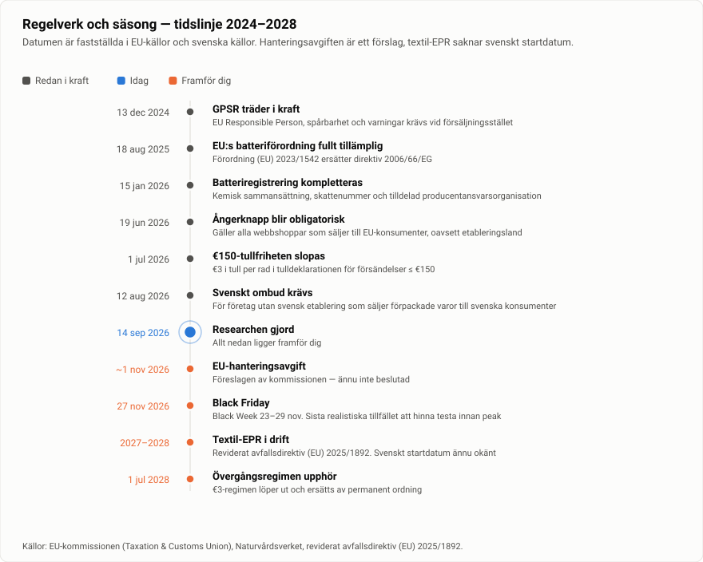

# Dropshipping Product Intelligence Engine
**Research-rapport · 14 september 2026 · Marknad: Sverige / EU**

Det här är resultatet av en bred produktresearch för att svara på en enda fråga:

> *"Om jag hade 10 000–50 000 kr att investera i att testa en ny e-commerce-produkt idag, vilken produkt skulle ge bäst risk/reward — och varför?"*

## Kort svar (läs hela motiveringen i [10-slutrekommendation.md](10-slutrekommendation.md))

| | Produkt | Score | Evidence | Varför kort |
|---|---|---|---|---|
| 🥇 | **Omklädningsrock för vinterbad** | ~~79~~ **80** | ~~70~~ **85** | **Upphöjd efter granskning.** Dryrobe omsätter £19,9–22M med £13M i kassan — tjugo gånger hundbadrockens tak. MOQ från 10 st ⇒ testorder ~15 000 kr. Men 20–30 % returer och dokumenterad IP-risk. [Kapitel 14](14-fordjupning-omkladningsrock.md) |
| 🥈 | **Premium hundbadrock / torkrock** | ~~80~~ **69** | ~~72~~ **84** | ⚠️ **Sänkt efter granskning.** Säsong, demo och logistik håller, men UK-ledaren omsätter <£1M, returgraden är 11 % och Tysklandsnischen krymper. [Kapitel 13](13-fordjupning-hundbadrock.md) |
| 🥉 | **Pälsdammsugare / grooming-kit för hund** | 73 | 76 | Högst verifierad efterfrågan i hundsegmentet (~10 000 enheter/mån på Amazon US för etta), spektakulär demo, men elektronik = WEEE + returrisk |

> **Läs det här först — guld och silver har bytt plats.** Efter att rapporten skrevs djupgranskade jag de två toppvalen med samma metodik. Hundbadrocken **föll** (80 → 69): kategoriledaren i UK omsätter under £1M. Omklädningsrocken **höll** (79 → 80): dess kategoriledare omsätter **£19,9–22M**, alltså ungefär tjugo gånger så mycket.
>
> **Omklädningsrocken är nu rapportens etta.** Se [kapitel 14](14-fordjupning-omkladningsrock.md) för head-to-head och [kapitel 13](13-fordjupning-hundbadrock.md) för varför hundbadrocken sänktes. Kapitel 3, 4, 10 och 11 skrevs före granskningarna.

**Den viktigaste strategiska slutsatsen är inte en produkt utan en position:** de tre största TikTok Shop-kategorierna (skincare, kosmetik, kosttillskott) är i praktiken *stängda* för ett snabbt svenskt test på grund av CPNP-registrering och EU Responsible Person. Samtidigt försvann EU:s €150-tullfrihet den 1 juli 2026. Tillsammans betyder det att den klassiska "AliExpress → Meta-ads → EU-konsument"-modellen är strukturellt sämre 2026 än 2024 — och att en **svensk, compliant, nischad operatör med EU-lager har en verklig fördel** som lata utländska dropshippers inte kan kopiera billigt.

Läs [02-marknadsvillkor-eu-sverige.md](02-marknadsvillkor-eu-sverige.md) först. Den ramen avgör mer av utfallet än produktvalet.

*Varför den här bilden är den viktigaste i rapporten: **smart fågelmatare** ligger högst upp till höger — högst evidens, tredje högst score — och är ändå ett **NEJ**. Bird Buddy har ~$100 M i intäkt och står redan hos Elgiganten, Arken Zoo och VetZoo. Hög poäng är inte samma sak som rätt drag.*

## Innehåll

| Fil | Innehåll |
|---|---|
| [01-metod-och-evidens.md](01-metod-och-evidens.md) | Hur researchen gjordes, vilka källor som gick att nå, **vad jag inte kunde verifiera**, hur Score/Evidence beräknas, och var jag går emot branschkonsensus |
| [02-marknadsvillkor-eu-sverige.md](02-marknadsvillkor-eu-sverige.md) | De-minimis-slopandet, GPSR, EPR/WEEE/batteri, CPNP, moms, ångerknappen, CPM-nivåer, betalsätt, returer, TikTok Shops EU-status |
| [03-ranking-topp20.md](03-ranking-topp20.md) | Rankingtabell, fullständigt scoreblad med delpoäng, trendklassificering, och vad jag uteslöt |
| [04-djupanalys-topp20.md](04-djupanalys-topp20.md) | 20 produkter, en i taget: efterfrågan, trend, vinnande bolag, pris, kostnad, målgrupp, vinkel, kreativ, mättnad, risker, källor |
| [05-produktkluster.md](05-produktkluster.md) | 8 kluster och vilka som bär en nischbutik istället för en general store |
| [06-teardown-10-butiker.md](06-teardown-10-butiker.md) | 11 butiker och varumärken reverse-engineerade med trafik, intäktsestimat, annonsvolym och erbjudandestruktur |
| [07-annonsvinklar-och-hooks.md](07-annonsvinklar-och-hooks.md) | Hook-mönster, kreativstruktur, vad vinnarna gör, UGC-kostnader, och annonsekonomin per produkt |
| [08-white-space.md](08-white-space.md) | 12 konkreta lägen där efterfrågan är hög men utförandet svagt |
| [09-would-i-test.md](09-would-i-test.md) | "Would I actually start this?" — JA/KANSKE/NEJ för topp 10, med kill- och skalningskriterier |
| [10-slutrekommendation.md](10-slutrekommendation.md) | Guld/silver/brons med budget, prissättning, sourcing-mål, mätpunkter och skalningsvillkor |
| [11-7-dagars-testplan.md](11-7-dagars-testplan.md) | Dag-för-dag-plan med exakta KILL / ITERATE / SCALE-trösklar |
| [12-kallor.md](12-kallor.md) | Alla källor, vad var och en faktiskt visar, evidensnivå, och vad jag inte kunde nå |
| [13-fordjupning-hundbadrock.md](13-fordjupning-hundbadrock.md) | **Djupgranskning av hundbadrocken — som sänkte den från 80 till 69.** Bolagsdata, returstatistik, konkurrensdjup |
| [14-fordjupning-omkladningsrock.md](14-fordjupning-omkladningsrock.md) | **Samma granskning på omklädningsrocken — den höll (79 → 80) och är nu rapportens etta.** Head-to-head mot hundbadrocken |
| [research/raw/00-notes.md](research/raw/00-notes.md) | Rådata-loggen: varje siffra jag hittade, med datum och källa |
| [PR-BESKRIVNING.md](PR-BESKRIVNING.md) | Hela arbetet förklarat på en sida, med alla åtta diagram — färdig att klistra in som PR-beskrivning |
| [assets/](assets/) | Rapportens åtta diagram som SVG (och PNG under `assets/png/`) |
| [tools/make_charts.py](tools/make_charts.py) | Genererar diagrammen. Kör `python3 tools/make_charts.py` — inga beroenden |

## Tre varningar innan du läser vidare

1. **Score ≠ mätning.** Score (0–100) är min bedömning enligt en fast rubrik. Evidence Confidence (0–100) mäter hur starkt underlaget bakom bedömningen faktiskt är. En produkt kan ha Score 80 och Evidence 55 — det betyder "ser bra ut, men vi vet för lite". Blanda inte ihop dem.
2. **Jag kunde inte öppna Google Trends, Amazon, Meta Ad Library eller Kalodata direkt** i den här miljön (nätverksproxyn blockerade dem). All data kommer via sökmotorhämtade utdrag från tredjepartskällor. Det sätter ett tak på hur säkra siffrorna kan vara. Se [01-metod-och-evidens.md](01-metod-och-evidens.md).
3. **Alla intäkts- och försäljningssiffror från verktyg som asinsight, brandsearch och liknande är modellerade estimat**, inte rapporterade tal. De duger för att jämföra storleksordningar mellan produkter. De duger inte som underlag för en affärsplan.
